# coc-vimrc

**Configuration of my coc-nvim &amp; Vimrc**


<!-- vim-markdown-toc GFM -->

* [Vim Installation](#vim-installation)
	* [Installation Guide](#installation-guide)
	* [Github page](#github-page)
* [Neovim Installation(Optional)](#neovim-installationoptional)
	* [Neovim Installation guide](#neovim-installation-guide)
* [coc-nvim Installation](#coc-nvim-installation)
* [Plug.vim Install](#plugvim-install)
	* [Installation](#installation)
		* [Vim](#vim)
			* [Unix](#unix)
			* [Windows (PowerShell)](#windows-powershell)
		* [Neovim](#neovim)
			* [Unix, Linux](#unix-linux)
			* [Linux (Flatpak)](#linux-flatpak)
			* [Windows (PowerShell)](#windows-powershell-1)
* [Vim & Neovim configuration: How to use these scripts](#vim--neovim-configuration-how-to-use-these-scripts)
	* [For Vim](#for-vim)
	* [For Neovim](#for-neovim)
* [Neovim: Transitioning from Vim (*nvim-from-vim*)](#neovim-transitioning-from-vim-nvim-from-vim)
* [Plugin explanation & key mapping](#plugin-explanation--key-mapping)
	* [vim plugins](#vim-plugins)
		* [coc.nvim](#cocnvim)
		* [kotlin-vim](#kotlin-vim)
		* [vim-visual-multi](#vim-visual-multi)
			* [Basic usage:](#basic-usage)
			* [Documentation](#documentation)
			* [Wiki](#wiki)
		* [undotree](#undotree)
			* [Usage](#usage)
		* [vim-easy-align](#vim-easy-align)
			* [Demo](#demo)
				* [Using predefined alignment rules](#using-predefined-alignment-rules)
				* [`=`](#)
				* [`<Space>`](#space)
				* [`,`](#-1)
				* [Using regular expression](#using-regular-expression)
				* [Aligning table cells](#aligning-table-cells)
				* [Syntax-aware alignment](#syntax-aware-alignment)
				* [Using blockwise-visual mode](#using-blockwise-visual-mode)
			* [Demo](#demo-1)
				* [Using predefined alignment rules](#using-predefined-alignment-rules-1)
				* [`=`](#-2)
				* [`<Space>`](#space-1)
				* [`,`](#-3)
				* [Using regular expression](#using-regular-expression-1)
				* [Aligning table cells](#aligning-table-cells-1)
				* [Syntax-aware alignment](#syntax-aware-alignment-1)
				* [Using blockwise-visual mode](#using-blockwise-visual-mode-1)
		* [calendar.vim](#calendarvim)
			* [Basic Usage](#basic-usage-1)
		* [vim-autoformat](#vim-autoformat)
		* [vim-gitgutter](#vim-gitgutter)
		* [vim-surround](#vim-surround)
			* [Example](#example)
		* [vim-markdown-toc](#vim-markdown-toc)
			* [Update existing table of contents](#update-existing-table-of-contents)
			* [Remove table of contents](#remove-table-of-contents)
		* [vim-airline](#vim-airline)
			* [Smarter tab line](#smarter-tab-line)
			* [vim-airline-themes](#vim-airline-themes)
		* [Indent Guides](#indent-guides)
			* [Usage](#usage-1)
		* [Markdown Preview for (Neo)vim](#markdown-preview-for-neovim)
	* [coc-nvim extensions](#coc-nvim-extensions)
		* [Language servers](#language-servers)
			* [coc-clangd](#coc-clangd)
			* [coc-css](#coc-css)
			* [coc-flutter](#coc-flutter)
			* [coc-html](#coc-html)
			* [coc-json](#coc-json)
			* [coc-python](#coc-python)
			* [coc-tsserver](#coc-tsserver)
			* [coc-vimlsp](#coc-vimlsp)
			* [coc-yaml](#coc-yaml)
		* [Other coc extensions](#other-coc-extensions)
			* [coc-marketplace](#coc-marketplace)
				* [Usage](#usage-2)
			* [coc-prettier](#coc-prettier)
				* [Update your `coc-settings.json` for format on save](#update-your-coc-settingsjson-for-format-on-save)
			* [coc-snippets](#coc-snippets)
				* [vim-snippets](#vim-snippets)
			* [coc-explorer](#coc-explorer)
			* [coc-translator](#coc-translator)

<!-- vim-markdown-toc -->

## Vim Installation

### [Installation Guide](https://www.vim.org/download.php)

### [Github page](https://github.com/vim/vim)

## Neovim Installation(Optional)

[](https://neovim.io)

Neovim is a project that seeks to aggressively refactor Vim in order to:

- Simplify maintenance and encourage [contributions](CONTRIBUTING.md)
- Split the work between multiple developers
- Enable [advanced UIs] without modifications to the core
- Maximize [extensibility](https://github.com/neovim/neovim/wiki/Plugin-UI-architecture)

See the [Introduction](https://github.com/neovim/neovim/wiki/Introduction) wiki page and [Roadmap]
for more information.

### Neovim Installation guide

- [Neovim website](https://neovim.io/)

- [Installation Guide](https://github.com/neovim/neovim/wiki/Installing-Neovim)

## coc-nvim Installation
- First Install [coc-nvim](https://github.com/neoclide/coc.nvim)
Don't forget to install `nodejs` and `npm`

```bash
sudo apt-get install nodejs npm
```
OR
```bash
sudo pacman -S nodejs npm
```

Note: If you are in China,change the **npm source**(Taobao registry) by following command
```bash
npm config set registry https://registry.npm.taobao.org
```

## [Plug.vim](https://github.com/junegunn/vim-plug) Install

A minimalist Vim plugin manager.


### Installation

[Download plug.vim](https://raw.githubusercontent.com/junegunn/vim-plug/master/plug.vim)
and put it in the "autoload" directory.

#### Vim

##### Unix

```sh
curl -fLo ~/.vim/autoload/plug.vim --create-dirs \
    https://raw.githubusercontent.com/junegunn/vim-plug/master/plug.vim
```

You can automate the process by putting the command in your Vim configuration
file as suggested [here][auto].

[auto]: https://github.com/junegunn/vim-plug/wiki/tips#automatic-installation

##### Windows (PowerShell)

```powershell
iwr -useb https://raw.githubusercontent.com/junegunn/vim-plug/master/plug.vim |`
    ni $HOME/vimfiles/autoload/plug.vim -Force
```

#### Neovim

##### Unix, Linux

```sh
sh -c 'curl -fLo "${XDG_DATA_HOME:-$HOME/.local/share}"/nvim/site/autoload/plug.vim --create-dirs \
       https://raw.githubusercontent.com/junegunn/vim-plug/master/plug.vim'
```

##### Linux (Flatpak)

```sh
curl -fLo ~/.var/app/io.neovim.nvim/data/nvim/site/autoload/plug.vim \
    https://raw.githubusercontent.com/junegunn/vim-plug/master/plug.vim
```

##### Windows (PowerShell)

```powershell
iwr -useb https://raw.githubusercontent.com/junegunn/vim-plug/master/plug.vim |`
    ni "$(@($env:XDG_DATA_HOME, $env:LOCALAPPDATA)[$null -eq $env:XDG_DATA_HOME])/nvim-data/site/autoload/plug.vim" -Force
```

## Vim & Neovim configuration: How to use these scripts

**Notice**: These config files suit my own needs,Please **DO NOT** just copy this configuration folder without really understanding about it! Please, at least, read this README file!

### For Vim

1. After you install `Plug.vim`,copy `.vimrc` and `coc-settings.json` Scripts to `$HOME/` & `$HOME/.vim/`

2. Reopen `Vim`

3. Wait Coc Extension installing finished

4. Execute `:PlugInstall` to Finish VIM Plugin install

5. Configure the rest components

### For Neovim

1. After you install `Plug.vim`,copy `init.vim` to `$HOME/.config/nvim/`
2. Reopen `Neovim`

## Neovim: Transitioning from Vim (*nvim-from-vim*)

*nvim-from-vim*

1. To start the transition, create your [init.vim](https://neovim.io/doc/user/init.html) (user [config](https://neovim.io/doc/user/starting.html#config)) file:

```vim
:call mkdir(stdpath('config'), 'p')
:exe 'edit '.stdpath('config').'/init.vim'
```

2. Add these contents to the file:

```vim
    set runtimepath^=~/.vim runtimepath+=~/.vim/after
    let &packpath = &runtimepath
    source ~/.vimrc
```

3. Restart Nvim, your existing Vim [config](https://neovim.io/doc/user/starting.html#config) will be loaded.

See |[provider-python](https://neovim.io/doc/user/provider.html#provider-python)| and |[provider-clipboard](https://neovim.io/doc/user/provider.html#provider-clipboard)| for additional software you
might need to use some features.

Your Vim configuration might not be entirely Nvim-compatible.
See |[vim-differences](https://neovim.io/doc/user/vim_diff.html#vim-differences)| for the full [list](https://neovim.io/doc/user/eval.html#list) of changes.

The |['ttymouse'](https://neovim.io/doc/user/vim_diff.html#'ttymouse')| option, for example, was removed from Nvim (mouse support
should work without [it](https://neovim.io/doc/user/motion.html#it)). If you use the same |[vimrc](https://neovim.io/doc/user/starting.html#vimrc)| for Vim and Nvim,
consider guarding |['ttymouse'](https://neovim.io/doc/user/vim_diff.html#'ttymouse')| in your configuration like so:

```vim
    if !has('nvim')
        set ttymouse=xterm2
    endif
```
 
Conversely, if you have Nvim specific configuration items, you could do
this:

```vim
    if has('nvim')
        tnoremap <Esc> <C-\><C-n>
    endif
```
 
For a more granular approach use YXXYexists()|:

```vim
    if exists(':tnoremap')
        tnoremap <Esc> <C-\><C-n>
    endif
```
 
Now you should be able to explore Nvim more comfortably. Check |[nvim-features](https://neovim.io/doc/user/vim_diff.html#nvim-features)| for more information.

## Plugin explanation & key mapping

### vim plugins

#### [coc.nvim](https://github.com/neoclide/coc.nvim)

Follow [Installation](#installation)

#### [kotlin-vim](https://github.com/udalov/kotlin-vim)


#### [vim-visual-multi](https://github.com/mg979/vim-visual-multi)

| Shortcut     | Action                                             |
| :------------: | :--------------------------------------------------: |
| `Ctrl`+`n`   | **Select next key (multiple cursors)**             |
| `q`          | **Deselect the current keys (multiple cursors)**   |
| `N`          | Select the previous key                            |
| `n`          | Select the next key                                |
| `Esc`        | Quit mutiple cursors                               |

To minimize chances for conflicts, a leader that is specific to VM is defined. The default is `\\` (two backslashes), but you can change it by setting:

```
let g:VM_leader = {your VM leader}
```

##### Basic usage:

- select words with <kbd>Ctrl-N</kbd> (like `Ctrl-d` in Sublime Text/VS Code)
- create cursors vertically with <kbd>Ctrl-Down</kbd>/<kbd>Ctrl-Up</kbd>
- select one character at a time with <kbd>Shift-Arrows</kbd>
- press <kbd>n</kbd>/<kbd>N</kbd> to get next/previous occurrence
- press <kbd>[</kbd>/<kbd>]</kbd> to select next/previous cursor
- press <kbd>q</kbd> to skip current and get next occurrence
- press <kbd>Q</kbd> to remove current cursor/selection
- start insert mode with <kbd>i</kbd>,<kbd>a</kbd>,<kbd>I</kbd>,<kbd>A</kbd>

Two main modes:

- in _cursor mode_ commands work as they would in normal mode
- in _extend mode_ commands work as they would in visual mode
- press <kbd>Tab</kbd> to switch between «cursor» and «extend» mode

Most vim commands work as expected (motions, <kbd>r</kbd> to replace characters, <kbd>~</kbd> to change case, etc). Additionally you can:

- run macros/ex/normal commands at cursors
- align cursors
- transpose selections
- add patterns with regex, or from visual mode

And more... of course, you can enter insert mode and autocomplete will work.


##### Documentation

    :help visual-multi

For some specific topic it's often:

    :help vm-some-topic

##### [Wiki](https://github.com/mg979/vim-visual-multi/wiki)

The wiki was the first documentation for the plugin, but many pictures are
outdated and contain wrong mappings. Still, you can take a look.

You could read at least the [Quick Start](https://github.com/mg979/vim-visual-multi/wiki/Quick-start).
 
 Quick refer the [Key mapping](https://github.com/mg979/vim-visual-multi/wiki/Mappings)

Insert mode with autocomplete, alignment (mappings in pic have changed, don't trust them)

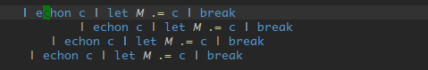

-------
Undo/Redo edits and selections

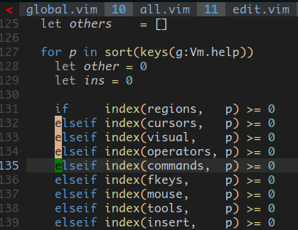

-------
Alternate cursor/extend mode, motions (even %), reverse direction (as in visual mode) and extend from the back. At any time you can switch from extend to cursor mode and viceversa.

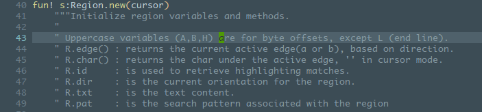

-------
Select inside/around brackets/quotes/etc:

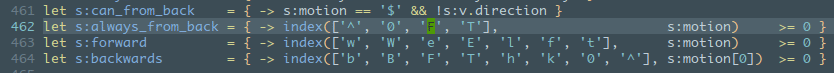

-------
Select operator, here shown with 'wellle/targets.vim' plugin: sib, sia, saa + selection shift

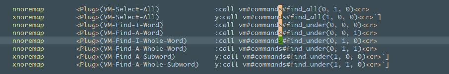

-------
Synched column transposition

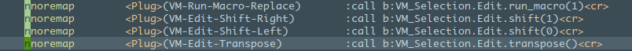

-------
Unsynched transposition (cycle all regions, also in different lines)


-------
Shift regions left and right (M-S-\<\>)

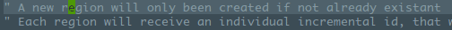

------
Find words under cursor, add new words (patterns stack), navigate regions, skip them, add regions with regex.

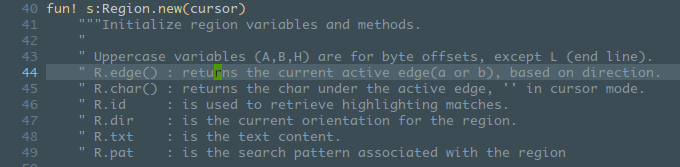

#### [undotree](https://github.com/mbbill/undotree)


##### Usage

| Shortcut                  | Action                       |
| :----:                    | :----:                       |
| `:UndotreeToggle` OR `F5` | toggle the undo-tree panel.  |
| `:redo` OR `<ctrl-r>`     | restore                      |
| `[ number ]`              | marks the most recent change |

 1. Use `:UndotreeToggle` to toggle the undo-tree panel. You may want to map this command to whatever hotkey by adding the following line to your vimrc, take `F5` for example.
```
nnoremap <F5> :UndotreeToggle<CR>
```
 1. Markers
    * Every change has a sequence number and it is displayed before timestamps.
    * The current state is marked as `> number <`.
    * The next state which will be restored by ``:redo`:redo` or ``<ctrl-r>`<ctrl-r>` is marked as `{ number }`.
    * The `[ number ]` marks the most recent change.
    * The undo history is sorted by timestamps.
    * Saved changes are marked as `s` and the big `S` indicates the most recent saved change.
 1. Press `?` in undotree window for quick help.
 1. Persistent undo
    * Usually I would like to store the undo files in a seperate place like below.

```
if has("persistent_undo")
   let target_path = expand('~/.undodir')

    " create the directory and any parent directories
    " if the location does not exist.
    if !isdirectory(target_path)
        call mkdir(target_path, "p", 0700)
    endif

    let &undodir=target_path
    set undofile
endif
```

#### [vim-easy-align](https://github.com/junegunn/vim-easy-align)

**A simple, easy-to-use Vim alignment plugin.**

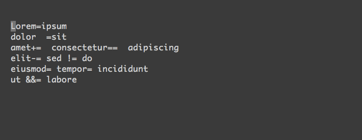

`ga` + **symbol** in normal or visual mode to align text based on **symbol**

- with the following lines of text,

```
apple   =red
grass+=green
sky-=   blue
```

try these commands:

- `vipga=`
    - `v`isual-select `i`nner `p`aragraph
    - Start EasyAlign command (`ga`)
    - Align around `=`
- `gaip=`
    - Start EasyAlign command (`ga`) for `i`nner `p`aragraph
    - Align around `=`

##### Demo


###### Using predefined alignment rules

An *alignment rule* is a predefined set of options for common alignment tasks,
which is identified by a single character, such as `<Space>`, `=`, `:`, `.`,
`|`, `&`, `#`, and `,`.

###### `=`


- `=` Around the 1st occurrences
- `2=` Around the 2nd occurrences
- `*=` Around all occurrences
- `**=` Left/Right alternating alignment around all occurrences
- `<Enter>` Switching between left/right/center alignment modes

###### `<Space>`


 
- `<Space>` Around the 1st occurrences of whitespaces
- `2<Space>` Around the 2nd occurrences
- `-<Space>` Around the last occurrences
- `<Enter><Enter>2<Space>` Center-alignment around the 2nd occurrences

###### `,`

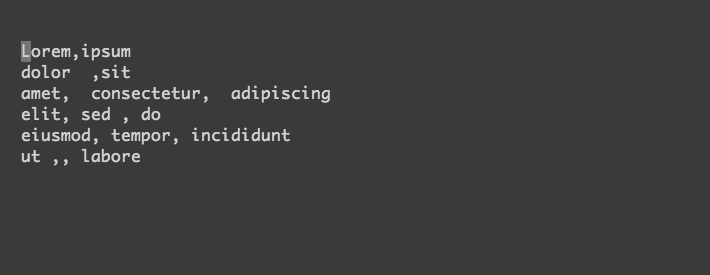

- The predefined comma-rule places a comma right next to the preceding token
  without margin (`{'stick_to_left': 1, 'left_margin': 0}`)
- You can change it with `<Right>` arrow

###### Using regular expression

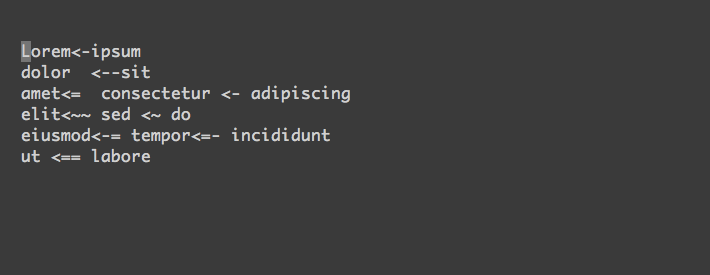

You can use an arbitrary regular expression by
- pressing `<Ctrl-X>` in interactive mode
- or using `:EasyAlign /REGEX/` command in visual mode or in normal mode with
  a range (e.g. `:%`)

Different ways to start


This demo shows how you can start interactive mode with visual selection or use
non-interactive `:EasyAlign` command.

###### Aligning table cells

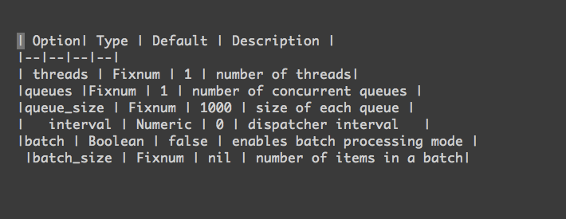


Check out various alignment options and "live interactive mode".

###### Syntax-aware alignment

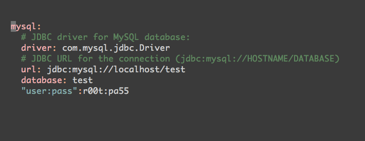


Delimiters in strings and comments are ignored by default.

###### Using blockwise-visual mode

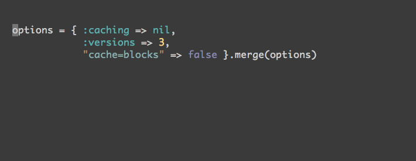

**A simple, easy-to-use Vim alignment plugin.**


`ga` + **symbol** in normal or visual mode to align text based on **symbol**

- with the following lines of text,

```
apple   =red
grass+=green
sky-=   blue
```

try these commands:

- `vipga=`
    - `v`isual-select `i`nner `p`aragraph
    - Start EasyAlign command (`ga`)
    - Align around `=`
- `gaip=`
    - Start EasyAlign command (`ga`) for `i`nner `p`aragraph
    - Align around `=`

##### Demo


###### Using predefined alignment rules

An *alignment rule* is a predefined set of options for common alignment tasks,
which is identified by a single character, such as `<Space>`, `=`, `:`, `.`,
`|`, `&`, `#`, and `,`.

###### `=`


- `=` Around the 1st occurrences
- `2=` Around the 2nd occurrences
- `*=` Around all occurrences
- `**=` Left/Right alternating alignment around all occurrences
- `<Enter>` Switching between left/right/center alignment modes

###### `<Space>`


 
- `<Space>` Around the 1st occurrences of whitespaces
- `2<Space>` Around the 2nd occurrences
- `-<Space>` Around the last occurrences
- `<Enter><Enter>2<Space>` Center-alignment around the 2nd occurrences

###### `,`


- The predefined comma-rule places a comma right next to the preceding token
  without margin (`{'stick_to_left': 1, 'left_margin': 0}`)
- You can change it with `<Right>` arrow

###### Using regular expression


You can use an arbitrary regular expression by
- pressing `<Ctrl-X>` in interactive mode
- or using `:EasyAlign /REGEX/` command in visual mode or in normal mode with
  a range (e.g. `:%`)

Different ways to start


This demo shows how you can start interactive mode with visual selection or use
non-interactive `:EasyAlign` command.

###### Aligning table cells


Check out various alignment options and "live interactive mode".

###### Syntax-aware alignment


Delimiters in strings and comments are ignored by default.

###### Using blockwise-visual mode


You can limit the scope with blockwise-visual mode.

#### [calendar.vim](https://github.com/itchyny/calendar.vim)

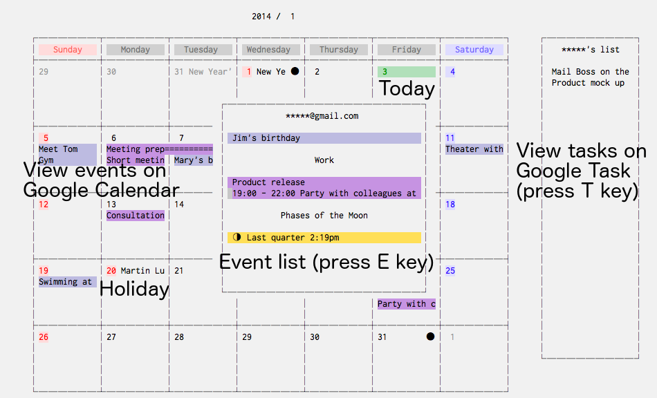

Press E key to view the event list, and T key to view the task list.
Also, press ? key to view a quick help.

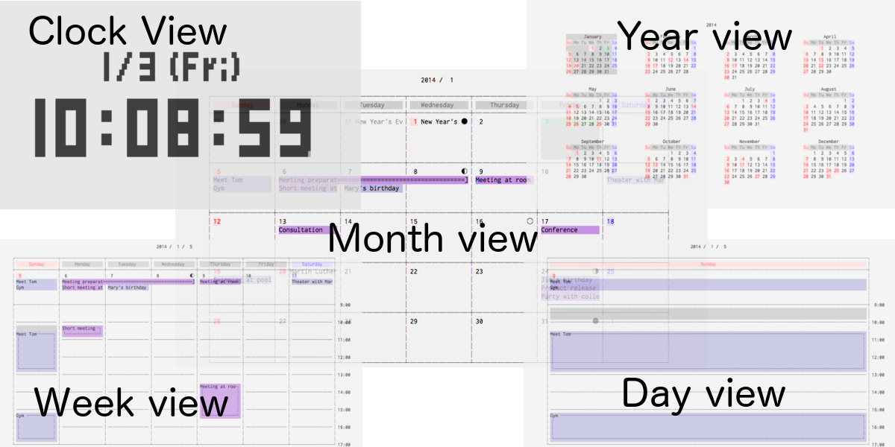

##### Basic Usage

    :Calendar

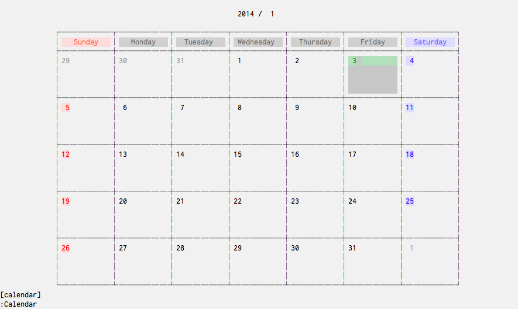

    :Calendar 2000 1 1

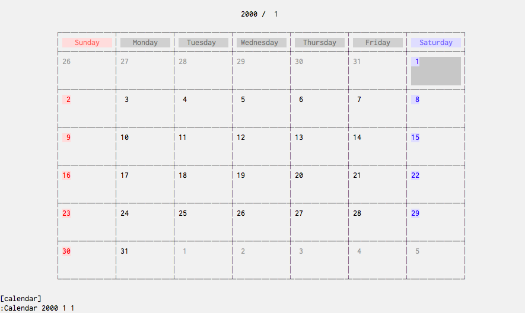

    :Calendar -view=year

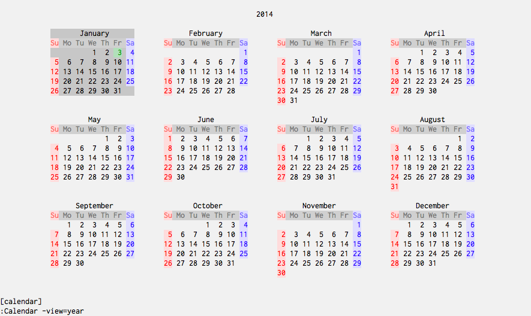

    :Calendar -view=year -split=vertical -width=27

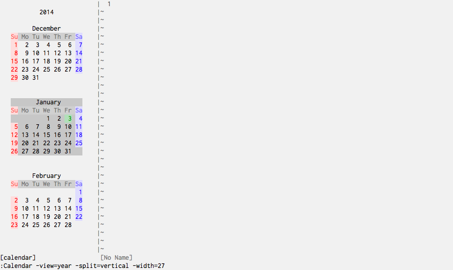

    :Calendar -view=year -split=horizontal -position=below -height=12

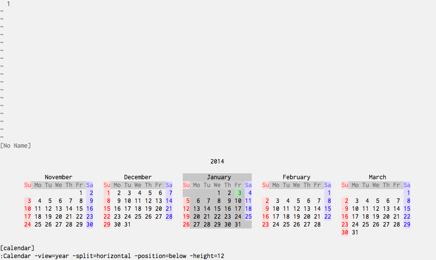

    :Calendar -first_day=monday

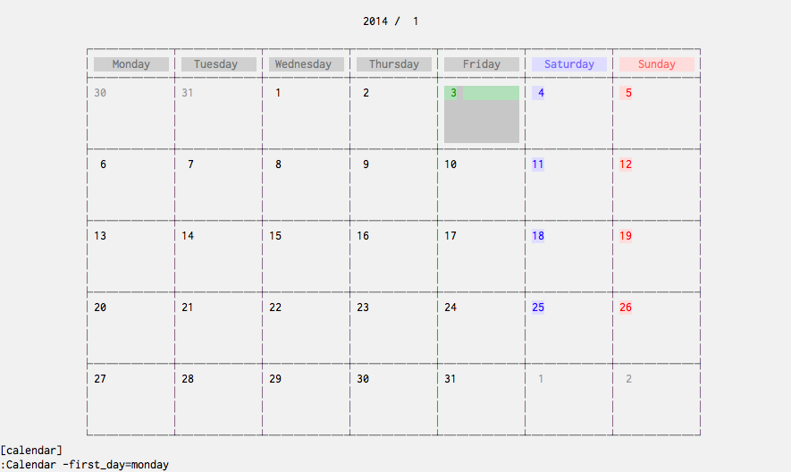

    :Calendar -view=clock

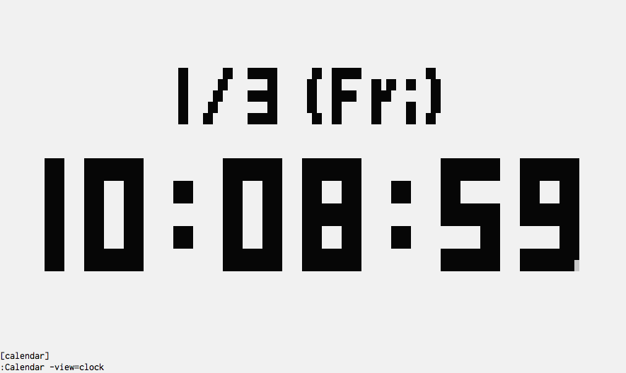

You can switch between views with &lt; and &gt; keys.


#### [vim-autoformat](https://github.com/Chiel92/vim-autoformat)

For convenience it is recommended that you assign a key for this, like so:

```vim
noremap <F3> :Autoformat<CR>
```

Basic usage: `:Autoformat` OR `F3`


#### [vim-gitgutter](https://github.com/airblade/vim-gitgutter)

A Vim plugin which shows a git diff in the sign column. It shows which lines have been added, modified, or removed. You can also preview, stage, and undo individual hunks; and stage partial hunks. The plugin also provides a hunk text object.


In the screenshot above you can see:

* Lines 183-184 are new.
* Lines 186-187 have been modified.
* The preview for the modified lines highlights changed regions within the line.

#### [vim-surround](https://github.com/tpope/vim-surround)

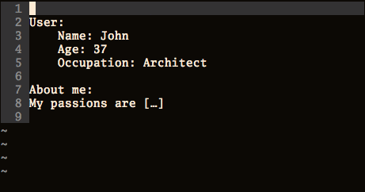

##### Example

Press `cs"'` inside

    "Hello world!"

to change it to

    'Hello world!'

Now press `cs'<q>` to change it to

    <q>Hello world!</q>

To go full circle, press `cst"` to get

    "Hello world!"

To remove the delimiters entirely, press `ds"`.

    Hello world!

Now with the cursor on "Hello", press `ysiw]` (`iw` is a text object).

    [Hello] world!

Let's make that braces and add some space (use `}` instead of `{` for no
space): `cs]{`

    { Hello } world!

Now wrap the entire line in parentheses with `yssb` or `yss)`.

    ({ Hello } world!)

Revert to the original text: `ds{ds)`

    Hello world!

Emphasize hello: `ysiw<em>`

    <em>Hello</em> world!

Finally, let's try out visual mode. Press a capital V (for linewise
visual mode) followed by `S<p class="important">`.

    <p class="important">
      <em>Hello</em> world!
    </p>

#### [vim-markdown-toc](https://github.com/mzlogin/vim-markdown-toc)


* Generate table of contents for Markdown files.

  Supported Markdown parsers:

  - [x] GFM (GitHub Flavored Markdown)
  - [x] GitLab
  - [x] Redcarpet

* Update existing table of contents.

* Auto update existing table of contents on save.

1. `:GenTocGFM`

    Generate table of contents in [GFM](https://github.github.com/gfm/) link style.

    This command is suitable for Markdown files in GitHub repositories, like `README.md`, and Markdown files for GitBook.

2. `:GenTocRedcarpet`

    Generate table of contents in [Redcarpet](https://github.com/vmg/redcarpet) link style.

    This command is suitable for Jekyll or anywhere else use Redcarpet as its Markdown parser.

3. `:GenTocGitLab`

    Generate table of contents in [GitLab](https://docs.gitlab.com/ee/user/markdown.html) link style.

    This command is suitable for GitLab repository and wiki.

4. `:GenTocMarked`

    Generate table of contents for [iamcco/markdown-preview.vim](https://github.com/iamcco/markdown-preview.vim) which use [Marked](https://github.com/markedjs/marked) markdown parser.

You can view [here](http://mazhuang.org/2015/12/05/diff-between-gfm-and-redcarpet/) to know differences between *GFM* and *Redcarpet* style toc links.

##### Update existing table of contents

Generally you don't need to do this manually, existing table of contents will auto update on save by default.

The `:UpdateToc` command, which is designed to update toc manually, can only work when `g:vmt_auto_update_on_save` turned off, and keep insert fence.

##### Remove table of contents

`:RemoveToc` command will do this for you, just remember keep insert fence option by default.

#### [vim-airline](https://github.com/vim-airline/vim-airline)

Lean & mean status/tabline for vim that's light as air.


When the plugin is correctly loaded, there will be a nice statusline at the
bottom of each vim window.

##### Smarter tab line

Automatically displays all buffers when there's only one tab open.


This is disabled by default; add the following to your vimrc to enable the extension:

    let g:airline#extensions#tabline#enabled = 1


##### [vim-airline-themes](https://github.com/vim-airline/vim-airline-themes)

#### [Indent Guides](https://github.com/nathanaelkane/vim-indent-guides)

Indent Guides is a plugin for visually displaying indent levels in Vim.


##### Usage
The default mapping to toggle the plugin is `<Leader>ig`.

You can also use the following commands inside Vim:

```vim
:IndentGuidesEnable
:IndentGuidesDisable
:IndentGuidesToggle
```

If you would like to have indent guides enabled by default, you can add the following to your `~/.vimrc`:

```vim
let g:indent_guides_enable_on_vim_startup = 1
```

#### [Markdown Preview for (Neo)vim](https://github.com/iamcco/markdown-preview.nvim)

**Preview markdown on your modern browser with synchronised scrolling and flexible configuration**

```vim
" Start the preview
:MarkdownPreview

" Stop the preview"
:MarkdownPreviewStop
```

### coc-nvim extensions

#### Language servers
##### [coc-clangd](https://github.com/clangd/coc-clangd)
##### [coc-css](https://github.com/neoclide/coc-css)
##### [coc-flutter](https://github.com/iamcco/coc-flutter)
##### [coc-html](https://github.com/neoclide/coc-html)
##### [coc-json](https://github.com/neoclide/coc-json)
##### [coc-python](https://github.com/neoclide/coc-python)
##### [coc-tsserver](https://github.com/neoclide/coc-tsserver)
##### [coc-vimlsp](https://github.com/iamcco/coc-vimlsp)
##### [coc-yaml](https://github.com/neoclide/coc-yaml)

#### Other coc extensions
 
##### [coc-marketplace](https://github.com/fannheyward/coc-marketplace)
[coc.nvim](https://github.com/neoclide/coc.nvim)  extensions marketplace.

* search `keywords:coc.nvim` from npmjs.com, display extensions in `coc-lists`
* extension name starts with `√` means installed already, with an `uninstall` action
* extension name starts with `x` means uninstalled, with an `install` action
* extension name ends with `*` is published by @chemzqm, IMO, is official

###### Usage

* `:CocList marketplace` list all available extensions
* `:CocList marketplace python` to search extension that name contains `python`

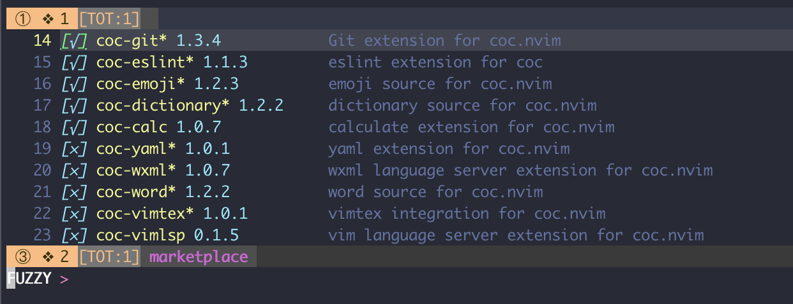 

##### [coc-prettier](https://github.com/neoclide/coc-prettier)
 
you can use `:Prettier` to format current buffer.
your can `<leader>f` for range format.
 
Prettier range format only support languageId including: `javascript`,`javascriptreact`, `typescript`, `typescriptreact`, `json` and `graphql`.


###### Update your `coc-settings.json` for format on save

Open settings file with:

    :CocConfig

Add:

```
  "coc.preferences.formatOnSaveFiletypes": ["css", "markdown"],
```

to setup the languages which you want to format on save.

##### [coc-snippets](https://github.com/neoclide/coc-snippets)
 
 | Shortcut                  | Action                                                                                      |
 | :----:                      | :----:                                                                                        |
 | `Insert Mode`  `Ctrl` `l` | coc-snippets-expand<br>(trigger snippet expand)                                                 |
 | `Visual Mode`  `Ctrl` `j` | coc-snippets-select<br>(select text for visual placeholder of snippet)                          |
 | `Ctrl` `j`                | coc_snippet_next<br>(jump to next placeholder, it's default of coc.nvim)                        |
 | `Ctrl` `k`                | coc_snippet_prev<br>(jump to previous placeholder, it's default of coc.nvim)                    |
 | `xmap` `<leader>` `x`     | coc-convert-snippet <br>(Use <leader>x for convert visual selected code to snippet)             |
 | `imap` `<C-j>` `<Plug>`   | coc-snippets-expand-jump <br>(Use <C-j> for both expand and jump (make expand higher priority.) |

Make `<tab>` used for trigger completion, completion confirm, snippet expand and jump like VSCode.


###### [vim-snippets](https://github.com/honza/vim-snippets)

vim-snipmate default snippets (Previously snipmate-snippets)

This repository contains snippets files for various programming languages.

- `snippets/*`: snippets using snipMate format
- `UltiSnips/*`: snippets using UltiSnips format

##### [coc-explorer](https://github.com/weirongxu/coc-explorer)

Explorer extension for [coc.nvim](https://github.com/neoclide/coc.nvim)

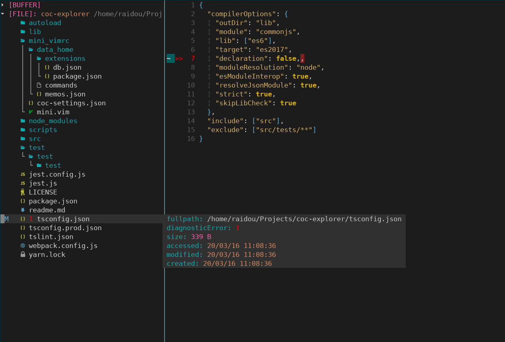

* Open explorer
   ```
   <space>e
   ```

##### [coc-translator](https://github.com/voldikss/coc-translator)

Translation extension for [coc.nvim](https://github.com/neoclide/coc.nvim).

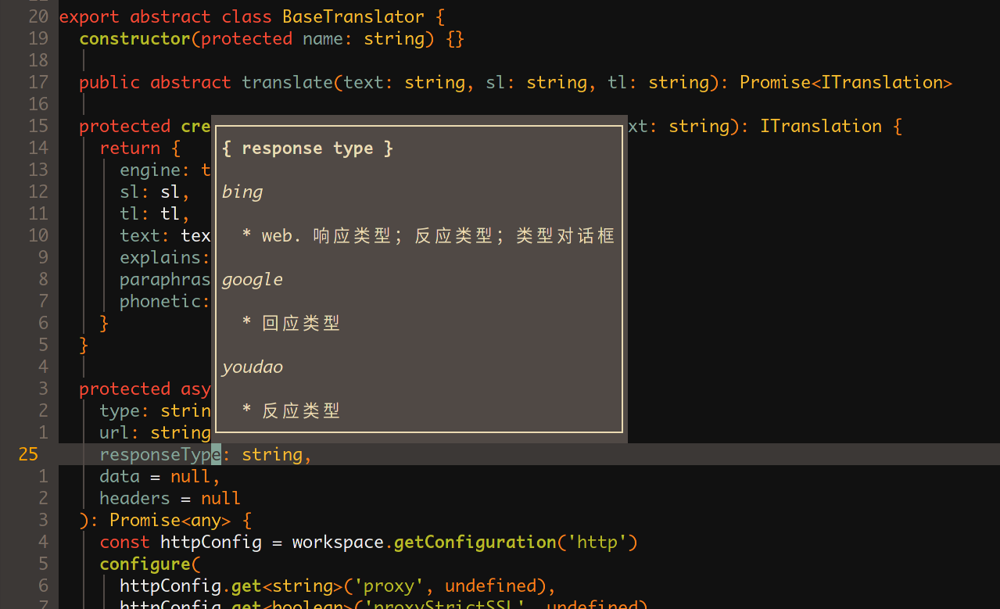

| Shortcut       | Action  |
| ----           | ----    |
| `<Leader>` `t` | popup   |
| `<Leader>` `t` | echo    |
| `<Leader>` `t` | replace |

